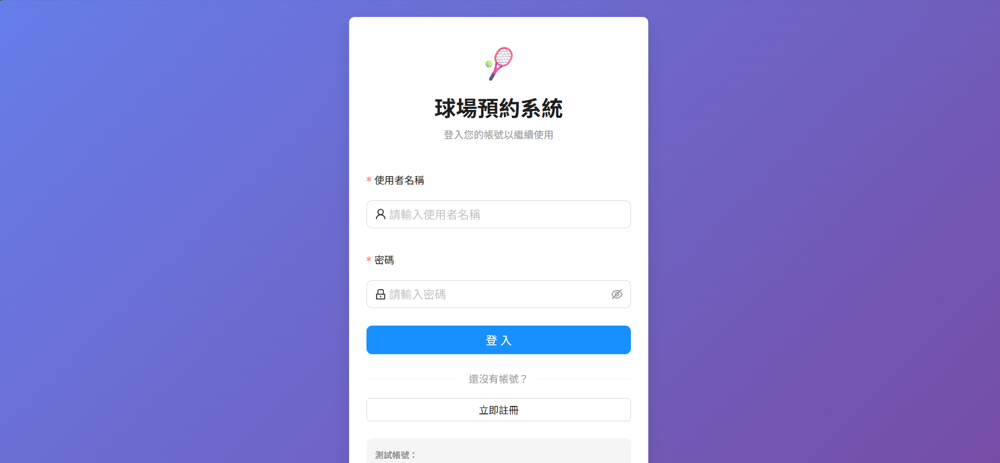
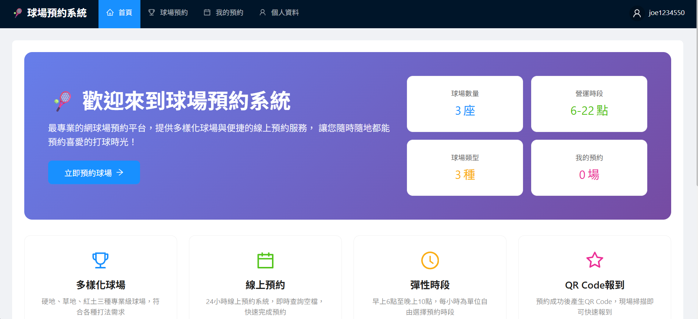
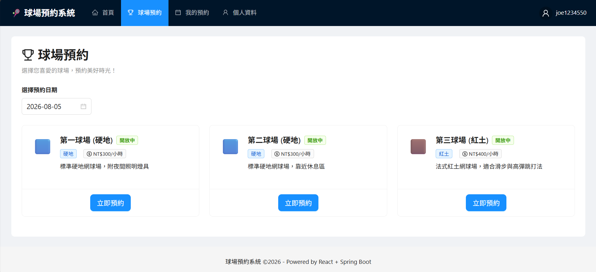

# 🎾 網球預約系統（Tennis Court Booking System）
> 目的是為了讓球友可以預約某場館的網球場，並能顯示球場數量、預約時段、可預約場地、已預約場地
> 管理者在前、後端可協助電話預約的球友預約球場、修改、取消，亦可透過電話協助新增會員、刪除
---

## ⚡ 第一次啟動（5 分鐘）

### 1. 準備資料庫（PostgreSQL 容器）

```bash
docker run -d --name my_SQL \
  -e POSTGRES_PASSWORD=my_secret_password \
  -p 5434:5432 postgres:15

# 建立這個專案用的資料庫
docker exec my_postgres psql -U postgres -c "CREATE DATABASE starter_db;"
```

### 2. 啟動專案

```bash
./mvnw spring-boot:run
```

看到 `Started StarterApplication` 就成功了。Flyway 會自動建好認證相關的表（users / roles / permissions / refresh_tokens）。


### 3. 啟動前端

在 `frontend` 資料夾執行：

```powershell
cd frontend
npm install
npm run dev
```

前端預設啟動在：
- `http://localhost:5173`

---

## ✅ 測試與驗證

### 預設測試帳號
- `testuser / password123` → 一般會員
- `adminuser / password123` → 管理員

### 後端管理員登入頁面
- `http://localhost:5173`

### 前端入口
- `http://localhost:5173`

---
## 🔧 專案架構

```
Book_Court-master/
├── 📄 pom.xml                             # Maven 依賴與後端建置設定
│
├── 🎨 frontend/                           # 前端專案 (React + Vite + TypeScript)
│   ├── 📄 index.html                      # HTML 入口
│   ├── 📄 package.json                    # 前端依賴與 npm scripts
│   ├── 📄 tsconfig.json                   # TypeScript 配置
│   ├── 📄 vite.config.ts                  # Vite 設定（Port 5173, Proxy /api -> :8080）
│   └── 📂 src/
│       ├── 📄 main.tsx                    # 前端程式總入口
│       ├── 📂 api/                        # Axios / API 呼叫封裝
│       ├── 📂 components/                 # 可重用 UI 元件
│       ├── 📂 pages/                      # 各頁面元件（球場預約、使用者/管理員後台）
│       ├── 📂 router/
│       │   └── 📄 AppRouter.tsx           # 前端路由控管與 Auth Guard
│       ├── 📂 store/
│       │   └── 📄 authStore.ts            # JWT 與登入狀態管理 (Zustand / Redux)
│       ├── 📂 types/                      # TypeScript 型別定義 (DTO, Entity)
│       └── 📂 utils/                      # 工具函式與格式化邏輯
│
└── ☕ src/                                # 後端專案 (Spring Boot)
    └── 📂 main/
        ├── 📂 java/com/example/starter/   # Java 主程式碼
        │   ├── 📄 StarterApplication.java # Spring Boot 啟動進入點
        │   │
        │   ├── 📂 annotation/             # 自訂 AOP 註解
        │   │   ├── 📄 OperationLog.java           # 操作日誌切面註解
        │   │   └── 📄 PerformanceMonitor.java     # 效能監控切面註解
        │   │
        │   ├── 📂 aspect/                 # AOP 切面邏輯處理
        │   │   ├── 📄 OperationLogAspect.java     # 操作日誌攔截記錄切面
        │   │   └── 📄 PerformanceMonitorAspect.java # API 執行時間監控切面
        │   │
        │   ├── 📂 config/                 # 全域配置
        │   │   ├── 📄 OpenApiConfig.java          # OpenAPI / Swagger 3.0 配置
        │   │   └── 📄 SecurityConfig.java          # Spring Security 權限與 CORS 設定
        │   │
        │   ├── 📂 controller/             # RESTful API 控制層
        │   │   ├── 📄 AdminBookingController.java # 管理員預約管理 API
        │   │   ├── 📄 AdminFinancialController.java # 管理員財務報表與結帳 API
        │   │   ├── 📄 AdminLoginController.java     # 管理員登入 API
        │   │   ├── 📄 AdminPageController.java      # 後台頁面轉導/權限檢測 API
        │   │   ├── 📄 AdminUserController.java      # 管理員會員管理 API
        │   │   ├── 📄 AuthController.java           # 通用認證與 Token 刷新 API
        │   │   ├── 📄 BookingController.java        # 前台場地預約 API
        │   │   ├── 📄 CourtController.java          # 球場清單與狀態 API
        │   │   ├── 📄 ExampleController.java        # 範例測試 API
        │   │   ├── 📄 PromoCodeController.java      # 優惠碼折抵 API
        │   │   └── 📄 UserController.java           # 使用者個人資料 API
        │   │
        │   ├── 📂 dto/                    # 前後端資料傳輸物件 (Data Transfer Objects)
        │   │   ├── 📄 ApiErrorResponse.java        # 統一 API 錯誤回應結構
        │   │   ├── 📄 AuthResponse.java            # 認證成功回應 (包含 Token)
        │   │   ├── 📄 BookingResponse.java         # 預約詳細數據回應
        │   │   ├── 📄 CheckoutRequest.java         # 現場櫃檯結帳請求參數
        │   │   ├── 📄 CreateBookingRequest.java    # 新增預約請求參數
        │   │   ├── 📄 CreateUserRequest.java       # 管理員新增會員請求
        │   │   ├── 📄 LoginRequest.java            # 登入請求參數
        │   │   ├── 📄 MonthlyRevenueDTO.java       # 月度營收統計 DTO
        │   │   ├── 📄 RefreshTokenRequest.java     # 刷新 Token 請求
        │   │   ├── 📄 RegisterRequest.java        # 會員註冊請求
        │   │   ├── 📄 UpdateBookingRequest.java    # 修改預約內容請求
        │   │   └── 📄 UpdateUserRequest.java       # 更新使用者資料請求
        │   │
        │   ├── 📂 entity/                 # JPA 資料庫 Entity 實體與 Enum
        │   │   ├── 📂 Emum/                        # 系統列舉型別
        │   │   │   ├── 📄 CheckInStatus.java       # 報到狀態 (PENDING, CHECKED_IN)
        │   │   │   ├── 📄 CourtStatus.java         # 場地狀態 (AVAILABLE, MAINTENANCE)
        │   │   │   └── 📄 CourtType.java           # 場地類型 (HARD, CLAY, GRASS)
        │   │   ├── 📄 Booking.java                 # 預約紀錄 Entity
        │   │   ├── 📄 Court.java                   # 球場場地 Entity
        │   │   ├── 📄 FinancialTransaction.java    # 財務流水帳 Entity
        │   │   ├── 📄 OperationLogRecord.java      # 操作日誌紀錄 Entity
        │   │   ├── 📄 Permission.java              # 權限 Entity
        │   │   ├── 📄 PromoCode.java               # 優惠碼 Entity
        │   │   ├── 📄 RefreshToken.java            # Refresh Token Entity
        │   │   ├── 📄 Role.java                    # 角色 Entity
        │   │   └── 📄 User.java                    # 會員帳號 Entity
        │   │
        │   ├── 📂 exception/              # 全域例外處理機制
        │   │   ├── 📄 AdviceExampleAspect.java      # 例外處理 AOP 通知範例
        │   │   ├── 📄 BusinessException.java       # 商業邏輯自訂異常
        │   │   ├── 📄 ErrorCode.java               # 系統錯誤碼列舉
        │   │   ├── 📄 GlobalExceptionHandler.java # @ControllerAdvice 全域 Exception 捕捉器
        │   │   ├── 📄 InvalidTokenException.java    # Token 無效/違規異常
        │   │   ├── 📄 LoggingAspect.java          # 全域 Exception 日誌切面
        │   │   ├── 📄 ResourceNotFoundException.java # 資源查無紀錄異常
        │   │   └── 📄 TokenExpiredException.java   # Token 時效過期異常
        │   │
        │   ├── 📂 repository/             # JPA 資料存取層 (Spring Data JPA)
        │   │   ├── 📄 BookingRepository.java              # 預約資料庫存取
        │   │   ├── 📄 CourtRepository.java                # 球場場地資料庫存取
        │   │   ├── 📄 FinancialTransactionRepository.java # 財務交易明細存取
        │   │   ├── 📄 MonthlyRevenueProjection.java       # 月營收原生 SQL 投影介面
        │   │   ├── 📄 OperationLogRepository.java         # 操作日誌存取
        │   │   ├── 📄 PromoCodeRepository.java            # 優惠碼資料庫存取
        │   │   ├── 📄 RefreshTokenRepository.java           # Refresh Token 存取
        │   │   ├── 📄 RoleRepository.java                 # 角色權限存取
        │   │   └── 📄 UserRepository.java                 # 會員帳號存取
        │   │
        │   ├── 📂 security/               # Spring Security 7 + JWT 認證授權
        │   │   ├── 📄 JwtAuthenticationFilter.java  # 請求 JWT 權限攔截器
        │   │   ├── 📄 JwtUtils.java                 # Token 簽發/解析與驗證工具
        │   │   ├── 📄 UserDetailsServiceImpl.java  # 使用者載入介面實作
        │   │   └── 📄 UserPrincipal.java            # 自訂認證主體資訊
        │   │
        │   └── 📂 service/                # 業務邏輯層
        │       ├── 📄 AdminBookingService.java      # 後台預約調度與修改服務
        │       ├── 📄 AdminFinancialService.java    # 財務報表、結帳與沖銷服務
        │       ├── 📄 AdminService.java             # 後台綜合管理業務
        │       ├── 📄 BookingService.java           # 前台時段預約與衝突檢查服務
        │       ├── 📄 CourtService.java             # 球場狀態與費率維護服務
        │       ├── 📄 PromoCodeService.java         # 優惠碼驗證與折扣計算服務
        │       ├── 📄 RefreshTokenService.java      # Token 刷新與續補機制服務
        │       └── 📄 UserService.java              # 會員註冊與權限指派服務
        │
        └── 📂 resources/                   # 設定檔與 Migration 腳本
            ├── 📂 db/migration/           # Flyway 版本化資料庫腳本
            │   ├── 📄 V1__auth_schema.sql
            │   ├── 📄 V2__create_operation_log.sql
            │   ├── 📄 V3__create_table_courts_booking.sql
            │   ├── 📄 V4__insert_users_courts.sql
            │   ├── 📄 V5__Insert_bookings.sql
            │   ├── 📄 V6__insert_booking_status.sql
            │   ├── 📄 V7__fix_seed_user_passwords.sql
            │   ├── 📄 V8__add_promo_code_and_revenue.sql
            │   ├── 📄 V9__add_promo_code_status.sql
            │   └── 📄 V9__financial_transactions.sql
            └── 📂 static/
                └── 📄 admin-login.html    # 後端備用靜態管理員登入頁
```
## 📊 ER圖（Mermaid）

```mermaid
這裡為你更正完全對應專案（包含優惠碼 PromoCode、財務流水帳 FinancialTransaction、操作日誌 OperationLogRecord）的完整 Mermaid ER 圖：

程式碼片段
erDiagram
    users {
        BIGINT id PK
        VARCHAR_50 username
        VARCHAR_100 email
        VARCHAR_255 password
        BOOLEAN enabled
        TIMESTAMP created_at
        TIMESTAMP updated_at
    }

    roles {
        BIGINT id PK
        VARCHAR_50 name
    }

    permissions {
        BIGINT id PK
        VARCHAR_100 name
    }

    user_roles {
        BIGINT user_id PK,FK
        BIGINT role_id PK,FK
    }

    role_permissions {
        BIGINT role_id PK,FK
        BIGINT permission_id PK,FK
    }

    refresh_tokens {
        BIGINT id PK
        VARCHAR_512 token
        BIGINT user_id FK
        TIMESTAMP expiry_date
    }

    operation_log {
        BIGINT id PK
        VARCHAR_100 module
        VARCHAR_50 action
        VARCHAR_255 description
        VARCHAR_255 method_name
        TEXT params
        TEXT result
        TEXT error_message
        VARCHAR_50 operator_id
        VARCHAR_100 operator_name
        BIGINT cost_millis
        BOOLEAN success
        TIMESTAMP created_at
    }

    courts {
        BIGSERIAL id PK
        VARCHAR_50 name
        VARCHAR_20 type
        VARCHAR_20 status
        TEXT description
        INT hourly_rate
        TIMESTAMP_TZ created_at
        TIMESTAMP_TZ updated_at
    }

    promo_codes {
        BIGINT id PK
        VARCHAR_50 code
        INT discount_amount
        VARCHAR_20 status
        TIMESTAMP expiry_date
        TIMESTAMP created_at
    }

    bookings {
        BIGSERIAL id PK
        BIGINT user_id FK
        BIGINT court_id FK
        BIGINT promo_code_id FK
        TIMESTAMP start_time
        TIMESTAMP end_time
        INT total_fee
        VARCHAR_20 status
        BOOLEAN is_checked_in
        TIMESTAMP check_in_time
        VARCHAR_20 check_in_status
        TIMESTAMP created_at
        TIMESTAMP updated_at
    }

    financial_transactions {
        BIGINT id PK
        BIGINT booking_id FK
        VARCHAR_100 user_name
        VARCHAR_100 court_name
        DECIMAL amount
        VARCHAR_50 payment_method
        VARCHAR_20 status
        TIMESTAMP created_at
    }

    %% 關聯外鍵約束 (Foreign Keys)
    users ||--o{ user_roles : "user_id"
    roles ||--o{ user_roles : "role_id"

    roles ||--o{ role_permissions : "role_id"
    permissions ||--o{ role_permissions : "permission_id"

    users ||--o{ refresh_tokens : "ON DELETE CASCADE"
    users ||--o{ bookings : "1對多 預約紀錄"
    courts ||--o{ bookings : "1對多 場地預約"
    promo_codes ||--o{ bookings : "優惠碼折抵"
    bookings ||--o| financial_transactions : "1對1 財務交易明細"
```


## 📋 重要 API

| 方法 | 路徑 | 說明 | 權限 |
|---|---|---|---|
| POST | `/api/auth/register` | 註冊 | 公開 |
| POST | `/api/auth/login` | 登入 | 公開 |
| POST | `/api/auth/refresh` | 刷新 Access Token | 公開 |
| POST | `/api/auth/refresh/cookie` | 使用 Cookie 刷新 Access Token | 公開 |
| GET | `/api/auth/refresh/cookie` | 使用 Cookie 刷新 Access Token (GET) | 公開 |
| POST | `/api/auth/logout` | 登出 | 已登入會員 |
| GET | `/admin/login` |轉導至管理員登入頁 | 公開 |
| POST | `/admin/login` |管理員 Form 表單登入 | 公開 |
| GET | `/admin/courts` |轉導至後台球場管理頁 | 管理員 |
| GET | `/admin/bookings` |轉導至後台球場管理頁 | 管理員 |
| GET | `/admin/users` |轉導至後台球場管理頁 | 管理員 |
| GET | `/api/v1/courts` | 查詢球場列表 | 公開 |
| GET | `/api/v1/bookings/court/{courtId}?date=YYYY-MM-DD` | 查詢球場指定日期已預約時段 | 公開 |
| POST | `/api/v1/bookings` | 建立預約 | 已登入會員 |
| GET | `/api/v1/bookings/my` | 查詢個人預約紀錄 | 已登入會員 |

---

## 🚀 常用指令

```powershell
./mvnw spring-boot:run          # 啟動後端
./mvnw clean test-compile       # 編譯檢查
./mvnw clean package            # 打包

cd frontend
npm install
npm run dev                   # 啟動前端
```

---

## 💡 注意事項

- 前後端是分離架構：後端 `8080`、前端 `5173`
- 前端使用 Vite proxy 將 `/api` 轉發給後端
- `application.yaml` 的 PostgreSQL port 目前是 `5434`
- 如果 `http://localhost:5173` 無法開啟，請確認 `npm run dev` 是否已成功啟動
- 如果要直接測後端管理員登入頁面，請使用 `http://localhost:8080/admin/login`

---

## 📌 套件版本

- Java 25
- Spring Boot 4.0.6
- PostgreSQL 15
- Flyway
- Spring Security 7
- Vite 5
- React 18
- TypeScript
- Ant Design
- Zustand

---

## 🔎 常見問題

### Q：我想直接打開 `http://localhost:5173`，但無法連線？
A：請先確保你在 `frontend` 目錄執行 `npm run dev`，並看到 Vite 成功啟動訊息。

### Q：前端 `/api` 的請求是誰處理？
A：Vite 會把 `/api` 代理到後端 `http://localhost:8080`，所以前端不用直接跨域呼叫後端。

### Q：我要新增球場或管理使用者，該從哪裡開始？
A：後端的管理員 API 在 `SecurityConfig.java` 中以 `ROLE_ADMIN` 控制權限，請從 `controller/`、`service/`、`repository/` 三層一起實作。

---

## 📌 補充

如果你希望，我可以再幫你把 README 加上「目前已完成功能清單」與「下一步開發待辦事項」。
---
## 📋 AI協作部分
前端所有使用者介面、後端AdminController AdminLoginController部分都是由AI協助產生
## DEMO


