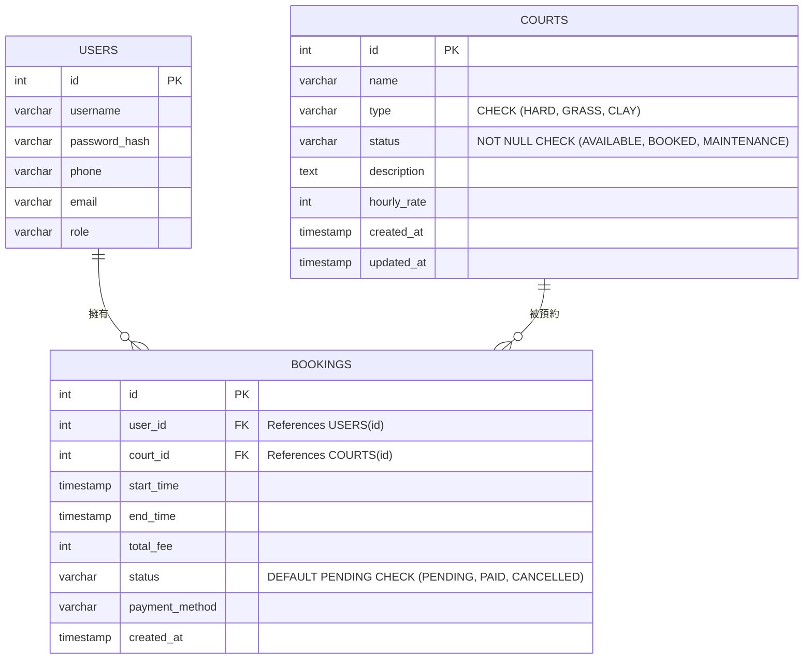

# 🎾 網球預約系統（Tennis Court Booking System）
> 目的是為了讓球友可以預約某場館的網球場，並能顯示球場數量、預約時段、可預約場地、已預約場地
> 管理者在前、後端可協助電話預約的球友預約球場、修改、取消，亦可透過電話協助新增會員、刪除
---

## ⚡ 第一次啟動（5 分鐘）

### 1. 準備資料庫（PostgreSQL 容器）

```bash
docker run -d --name my_SQL \
  -e POSTGRES_PASSWORD=my_secret_password \
  -p 5434:5432 postgres:15

# 建立這個專案用的資料庫
docker exec my_postgres psql -U postgres -c "CREATE DATABASE starter_db;"
```

### 2. 啟動專案

```bash
./mvnw spring-boot:run
```

看到 `Started StarterApplication` 就成功了。Flyway 會自動建好認證相關的表（users / roles / permissions / refresh_tokens）。


### 3. 啟動前端

在 `frontend` 資料夾執行：

```powershell
cd frontend
npm install
npm run dev
```

前端預設啟動在：
- `http://localhost:5173`

---

## ✅ 測試與驗證

### 預設測試帳號
- `testuser / password123` → 一般會員
- `adminuser / password123` → 管理員

### 後端管理員登入頁面
- `http://localhost:5173`

### 前端入口
- `http://localhost:5173`

---
## 🔧 專案架構

```
Book_Court-master/
├── 📄 pom.xml                             # Maven 依賴與後端建置設定
│
├── 🎨 frontend/                           # 前端專案 (React + Vite + TypeScript)
│   ├── 📄 index.html                      # HTML 入口
│   ├── 📄 package.json                    # 前端依賴與 npm scripts
│   ├── 📄 tsconfig.json                   # TypeScript 配置
│   ├── 📄 vite.config.ts                  # Vite 設定（Port 5173, Proxy /api -> :8080）
│   └── 📂 src/
│       ├── 📄 main.tsx                    # 前端程式總入口
│       ├── 📂 api/                        # Axios / API 呼叫封裝
│       ├── 📂 components/                 # 可重用 UI 元件
│       ├── 📂 pages/                      # 各頁面元件（球場預約、使用者/管理員後台）
│       ├── 📂 router/
│       │   └── 📄 AppRouter.tsx           # 前端路由控管與 Auth Guard
│       ├── 📂 store/
│       │   └── 📄 authStore.ts            # JWT 與登入狀態管理 (Zustand / Redux)
│       ├── 📂 types/                      # TypeScript 型別定義 (DTO, Entity)
│       └── 📂 utils/                      # 工具函式與格式化邏輯
│
└── ☕ src/                                # 後端專案 (Spring Boot 3)
    └── 📂 main/
        ├── 📂 java/com/example/starter/   # Java 主程式碼
        │   ├── 📄 StarterApplication.java # Spring Boot 啟動類別
        │   │
        │   ├── 📂 config/                 # 系統全域配置
        │   │   ├── 📄 OpenApiConfig.java  # Swagger / OpenAPI 3.0 配置
        │   │   └── 📄 SecurityConfig.java  # Spring Security 權限規則配置 (原 Admin/User 分流)
        │   │
        │   ├── 📂 controller/             # RESTful API 控制層
        │   │   ├── 📄 AdminController.java
        │   │   ├── 📄 AdminLoginController.java
        │   │   ├── 📄 AuthController.java
        │   │   ├── 📄 BookingController.java
        │   │   ├── 📄 CourtController.java
        │   │   └── 📄 UserController.java
        │   │
        │   ├── 📂 service/                # 業務邏輯層
        │   │   ├── 📄 BookingService.java
        │   │   ├── 📄 CourtService.java
        │   │   ├── 📄 RefreshTokenService.java
        │   │   └── 📄 UserService.java
        │   │
        │   ├── 📂 repository/             # Spring Data JPA 資料存取層
        │   │   ├── 📄 BookingRepository.java
        │   │   ├── 📄 CourtRepository.java
        │   │   ├── 📄 OperationLogRepository.java
        │   │   ├── 📄 RefreshTokenRepository.java
        │   │   ├── 📄 RoleRepository.java
        │   │   └── 📄 UserRepository.java
        │   │
        │   ├── 📂 security/               # Security / JWT 核心機制
        │   │   ├── 📄 JwtAuthenticationFilter.java  # JWT 請求攔截器
        │   │   ├── 📄 JwtUtils.java                 # Token 產生與解析工具
        │   │   ├── 📄 UserDetailsServiceImpl.java  # DB 使用者載入實作
        │   │   └── 📄 UserPrincipal.java            # 自訂 UserDetails 封裝
        │   │
        │   ├── 📂 dto/                    # 前後端資料傳輸物件
        │   │   ├── 📄 ApiErrorResponse.java
        │   │   ├── 📄 AuthResponse.java
        │   │   ├── 📄 BookingResponse.java
        │   │   ├── 📄 CreateBookingRequest.java
        │   │   ├── 📄 CreateUserRequest.java
        │   │   ├── 📄 LoginRequest.java
        │   │   ├── 📄 RefreshTokenRequest.java
        │   │   ├── 📄 RegisterRequest.java
        │   │   └── 📄 UpdateUserRequest.java
        │   │
        │   ├── 📂 entity/                 # JPA 資料庫實體與列舉
        │   │   ├── 📄 Booking.java
        │   │   ├── 📄 Court.java
        │   │   ├── 📄 OperationLogRecord.java
        │   │   ├── 📄 Permission.java
        │   │   ├── 📄 RefreshToken.java
        │   │   ├── 📄 Role.java
        │   │   ├── 📄 User.java
        │   │   └── 📂 Enum/
        │   │       ├── 📄 CheckInStatus.enum
        │   │       ├── 📄 CourtStatus.enum
        │   │       └── 📄 CourtType.enum
        │   │
        │   └── 📂 exception/              # 全域例外處理與 AOP 切面
        │       ├── 📄 BusinessException.java
        │       ├── 📄 ErrorCode.java
        │       ├── 📄 GlobalExceptionHandler.java # @ControllerAdvice 全域捕捉
        │       ├── 📄 InvalidTokenException.java
        │       ├── 📄 ResourceNotFoundException.java
        │       ├── 📄 TokenExpiredException.java
        │       ├── 📄 AdviceExampleAspect.java
        │       └── 📄 LoggingAspect.java          # 操作日誌 AOP 切面
        │
        └── 📂 resources/                   # 資源檔案
            ├── 📄 application.yaml        # 系統環境與資料庫連線配置
            ├── 📂 db/migration/           # Flyway 資料庫 Migration 腳本 (V1__...sql)
            └── 📂 static/
                └── 📄 admin-login.html    # 後端備用靜態管理員登入頁
```
## 📊 ER圖（Mermaid）




## 📋 重要 API

| 方法 | 路徑 | 說明 | 權限 |
|---|---|---|---|
| POST | `/api/auth/register` | 註冊 | 公開 |
| POST | `/api/auth/login` | 登入 | 公開 |
| POST | `/api/auth/refresh` | 刷新 Access Token | 公開 |
| POST | `/api/auth/logout` | 登出 | 公開 |
| GET | `/api/v1/courts` | 查詢球場列表 | 公開 |
| GET | `/api/v1/bookings/court/{courtId}?date=YYYY-MM-DD` | 查詢球場指定日期已預約時段 | 公開 |
| POST | `/api/v1/bookings` | 建立預約 | 已登入會員 |
| GET | `/api/v1/bookings/my` | 查詢個人預約紀錄 | 已登入會員 |

---

## 🚀 常用指令

```powershell
./mvnw spring-boot:run          # 啟動後端
./mvnw clean test-compile       # 編譯檢查
./mvnw clean package            # 打包

cd frontend
npm install
npm run dev                   # 啟動前端
```

---

## 💡 注意事項

- 前後端是分離架構：後端 `8080`、前端 `5173`
- 前端使用 Vite proxy 將 `/api` 轉發給後端
- `application.yaml` 的 PostgreSQL port 目前是 `5434`
- 如果 `http://localhost:5173` 無法開啟，請確認 `npm run dev` 是否已成功啟動
- 如果要直接測後端管理員登入頁面，請使用 `http://localhost:8080/admin/login`

---

## 📌 套件版本

- Java 25
- Spring Boot 4.0.6
- PostgreSQL 15
- Flyway
- Spring Security 7
- Vite 5
- React 18
- TypeScript
- Ant Design
- Zustand

---

## 🔎 常見問題

### Q：我想直接打開 `http://localhost:5173`，但無法連線？
A：請先確保你在 `frontend` 目錄執行 `npm run dev`，並看到 Vite 成功啟動訊息。

### Q：前端 `/api` 的請求是誰處理？
A：Vite 會把 `/api` 代理到後端 `http://localhost:8080`，所以前端不用直接跨域呼叫後端。

### Q：我要新增球場或管理使用者，該從哪裡開始？
A：後端的管理員 API 在 `SecurityConfig.java` 中以 `ROLE_ADMIN` 控制權限，請從 `controller/`、`service/`、`repository/` 三層一起實作。

---

## 📌 補充

如果你希望，我可以再幫你把 README 加上「目前已完成功能清單」與「下一步開發待辦事項」。
---
## 📋 AI協作部分
前端所有使用者介面、後端AdminController AdminLoginController部分都是由AI協助產生